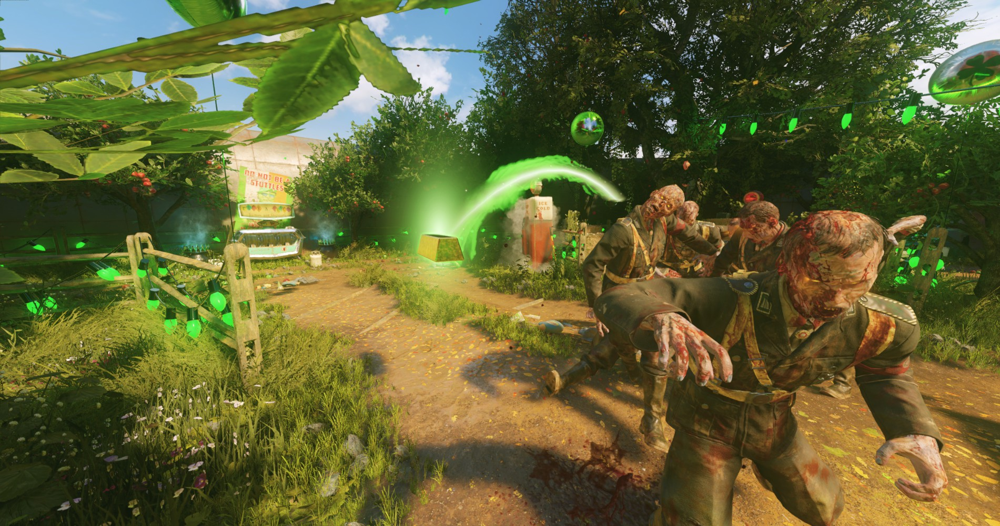
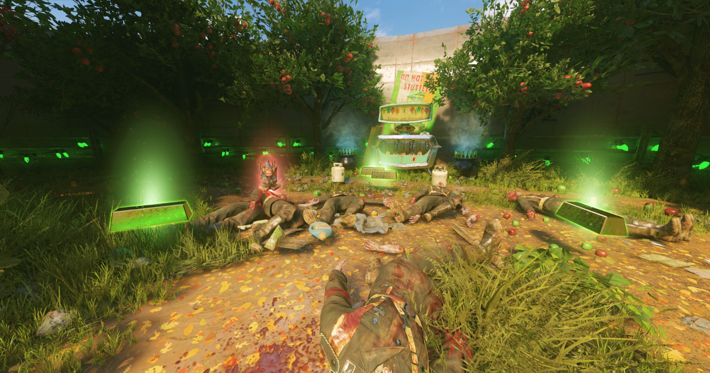

# ⭐Bo3CWStyleItemDrops⭐

This repo holds my attempt at scripting item drops featured in Call of Duty: Black Ops Cold War for Call of Duty: Black Ops III. This includes FX, Sounds, and Scripts with a full system for handling item drops from AI that die within the level. The script contains tons of variables to handle customization including function pointers that can be set to completely override functionality. ***This repo only contains a base script 

This script is fully scripted from the ground up without referencing CW's scripts and so may not 100% function like Cold War, if you are interested in porting Cold War's exact item drop functionality, then you can check out serious' [decompiled CW scripts](https://github.com/shiversoftdev/t9-src) and attempt to find the script that handles it.

# Installing

1. Head over to the [Releases](https://github.com/Scobalula/Bo3CWStyleItemDrops/releases) section and download the latest release.
2. Open the zip file and copy the contents into your Call of Duty: Black Ops III directory.
3. Open your map/mod's zone file and add the following items:
```
fx,_scobalula/item_drops/zombie_item_drops_blue
fx,_scobalula/item_drops/zombie_item_drops_green
fx,_scobalula/item_drops/zombie_item_drops_yellow
fx,_scobalula/item_drops/zombie_item_drops_red
material,mc/mtl_zombie_item_drops_blue
material,mc/mtl_zombie_item_drops_green
material,mc/mtl_zombie_item_drops_yellow
material,mc/mtl_zombie_item_drops_red
scriptparsetree,scripts/zm/_zm_item_drops.gsc
scriptparsetree,scripts/zm/_zm_item_drops.csc
```
4. Open your map/mod's gsc/csc file (for mods, the files you're using for injection) and add the following to where the using statements are:
```gsc
#using scripts\zm\_zm_item_drops;
#insert scripts\zm\_zm_item_drops.gsh;
```
5. Open your map/mod's szc file and add the following entry:
```json
{
    "Type" : "ALIAS",
    "Name" : "zm_item_drops",
    "Filename" : "zm_item_drops.csv",
    "Specs" : []
},
```

# Creating Custom Drops

Creating custom drops is very easy, the script exposes the following function to help with registering an item:

```gsc
function register_item_drop(item_name,
							item,
							rarity,
							chance,
							on_item_picked_up_func,
							pickup_type,
							pickup_hint                = undefined,
							on_spawn_item_model_func   = &on_spawn_item_model_default,
							on_item_dropped_func       = &on_item_dropped_default,
							on_item_cleaned_up_func    = &on_item_cleaned_up_default,
							on_drop_sound              = ZM_ITEM_DROPS_DEFAULT_LAND_SOUND,
							on_land_sound			   = ZM_ITEM_DROPS_DEFAULT_LAND_SOUND,
							on_pick_up_sound		   = ZM_ITEM_DROPS_DEFAULT_PICK_UP_SOUND)
```

As you can see from the parameters, only the first 5 are required, the rest are optional and are only exposed if you want to have greater control over the creation of the item and how it's handled.

Let's break down the required parameters:

* **item_name**: The name of the item to act as a key, i.e. money_drop.
* **item**: The actual item being dropped, by default this can either be a weapon or the name of an xmodel.
* **rarity**: The rarity of the item, explained below.
* **chance**: The chance this item has to drop, this isn't out of a particular value and the sum of all items is used.
* **on_item_picked_up_func**: This is the function that is called when the item is picked up.
* **pickup_type**: This defines whether or not the item is a touch item or unitrigger, defined by `ZM_ITEM_DROP_PICK_UP_TOUCH` or `ZM_ITEM_DROP_PICK_UP_UNITRIGGER` in the gsh file.

The optional parameters are for more advanced users and their usage can be determined by their usage throughout the script should you wish to get down to that level.

The rarities are simply provided to define the FX and Outline colors and do not actually have any bearing on how high of a chance the item has of dropping, this is determined by its chance, the following rarities are supported:

```
ZM_ITEM_DROPS_COMMON                Green
ZM_ITEM_DROPS_RARE                  Blue
ZM_ITEM_DROPS_LEGENDARY             Yellow
ZM_ITEM_DROPS_ULTRA                 Red
```

The `on_item_picked_up_func` actually handles the player picking up the item, a function for `on_item_picked_up_func` should be similar to this:

```gsc
function on_picked_up(drop_type, player)
{
    // self = dropped item (entity)
    return true;
}
```

Returning true tells the item drops system the pick up was successful, as the player may not be able to pick up the item, in that case we return false, for example:

```gsc
function on_picked_up(drop_type, player)
{
    // self = dropped item (entity)
    // Ensure we have a valid player
	if(!zm_utility::is_player_valid(player))
		return false;
    // Do item stuff
    return true;
}
```

# Registering Weapon Drops

The script by default provides a mechanism for dropping weapons without any extra set up:

```gsc
function register_weapon_drop(weapon, rarity, chance)
```

Let's break down the required parameters:

* **weapon**: The weapon to add to the list, if it doesn't exist, nothing is added.
* **item**: The actual item being dropped, by default this can either be a weapon or the name of an xmodel.
* **chance**: The chance this item has to drop, this isn't out of a particular value and the sum of all items is used.

You can safely call this function on weapons that are not present in the level, useful for mods that work across maps with different weapons. The script will simply not register the weapon if it doesn't exist.

By default the script will register all weapon drops as unitriggers.

# Customization

The script exposes settings that can be found in the gsh file. Most of them are stored in level variables that can also be edited on a per-map/mod basis.

The script also has tons of function pointer checks that allow you to add callbacks or override certain parts of the script such as drop location calculation. This is for more advanced users and can be checked within the script.

# Custom Drop Example

Let's register 3 different drop types as an example of how to use the script. 

## Money Drop

This example shows how to register a simple money drop, first let's add the following line to our gsc file to create the drop type:

```gsc
zm_item_drops::register_item_drop("money_drop", "zombietron_gold_brick", ZM_ITEM_DROPS_COMMON, 100, &on_money_picked_up);
```

Then we can add the following function to actually handle the drop:

```gsc
function on_money_picked_up(drop_type, player)
{
    // self = dropped item (entity)
    // Ensure we have a valid player
	if(!zm_utility::is_player_valid(player))
		return false;

    player zm_utility::play_sound_on_ent("purchase");
	player zm_score::player_add_points("bonus_points_powerup", RandomIntRange(5, 10) * 100);

    return true;
}
```

As you can see, we're simply running a check for a valid player, then adding to their score.

Finally, add the following xmodel to your zone file:

```
xmodel,zombietron_gold_brick
```

## Ammo Drop

This example shows how to register a simple ammo drop, first let's add the following line to our gsc file to create the drop type:

```gsc
zm_item_drops::register_item_drop("ammo_drop", "p7_pouch_ammo_01", ZM_ITEM_DROPS_RARE, 50, &on_ammo_picked_up);
```

Then we can add the following function to actually handle the drop:

```gsc
function on_ammo_picked_up(drop_type, player)
{
    // self = dropped item (entity)
    // Ensure we have a valid player
	if(player zm_utility::in_revive_trigger())
		return false;
	if(IS_DRINKING(player.is_drinking))
		return false;
	if(!zm_utility::is_player_valid(player))
		return false;
    if(player IsThrowingGrenade())
        return false;
    if(player IsMeleeing())
        return false;

    current_weapon = player GetCurrentWeapon();

    if(current_weapon == level.weaponNone)
        return false;
    if(zm_utility::is_offhand_weapon(current_weapon))
        return false;
    if(zm_weapons::is_wonder_weapon(current_weapon))
        return false;

    current_ammo = player GetWeaponAmmoStock(current_weapon);
    player SetWeaponAmmoStock(current_weapon, current_ammo + current_weapon.clipSize);
    player zm_utility::play_sound_on_ent("purchase");
    return true;
}
```

As you can see, we're simply running a check for a valid player, then adding to their stock ammo.

Finally, add the following xmodel to your zone file:

```
xmodel,p7_pouch_ammo_01
```

## Monkey Bombs

To register monkey bombs, we can simply call the single line weapon register function with a low chance and of ultra rarity:

```gsc
zm_item_drops::register_weapon_drop(GetWeapon("cymbal_monkey"), ZM_ITEM_DROPS_ULTRA, 10);
```

# Debugging Common Issues

* **Duplicate Assets**: While unlikely, you've installed assets that have the same names as mine, you'll have to resolve this yourself.
* **No drops**: You either haven't registered any drops or your settings are set so that they can only be spawned under certain conditions.
* **No Audio**: Sometimes you may need to compile multiple times due to bugs in Black Ops III sound compiler. You may also have genuine sound errors in another file that needs to be resolved.
* **Clientfield Mismatch**: You didn't add the using statement described in Step 4 to either your gsc or csc file meaning a clientfield was not registered in one or the other.

# Reporting Problems

Ultimately the script was made for my own purposes and released for the wider community to use. While I have battletested this script on both my own and stock maps to high rounds in developer mode, we're all human and so things may have bugs! If you run into issues feel free to open an issue, I am also open to anyone to improve the script by making a pull request! When working on your map always have `developer 2` on, as it helps to identify where problems are and it can also assist me in identifying possible problems and where they are within the script. Please also feel free to open an issue if you think there is a part of the instructions that is confusing, identifying confusing parts of the instructions helps me identify key areas I should focus in on or improve when writing documentation!

❤️ You can also join my Discord to report issues or get general help ❤️

[](https://discord.gg/RyqyThu)

# Credits

* raptroes for providing the OED loop that allows on screen outlines to work.

If you use the script there is no requirement to credit me, focus on making your projects extra spicy. 🌶️

# Screenshots




